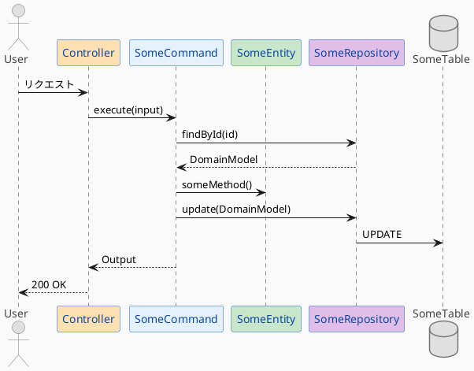

# PlantUML シーケンス図ルール

## 配置場所

各モジュールの `doc/` ディレクトリに配置する。

```
features/{module}/doc/{feature}-sequence.puml
```

例: `features/user/doc/change-password-sequence.puml`

## カラールール

レイヤーごとに色を統一する。

| レイヤー | 色 | カラーコード | 用途 |
|---------|-----|-------------|------|
| External | グレー | `#E0E0E0` | actor, database, queue |
| Note | 薄グレー | `#F5F5F5` | コメント |
| Presentation | オレンジ | `#FFE0B2` | Controller, RestApi |
| Application | 青 | `#E3F2FD` | Command, Query |
| Domain | 緑 | `#C8E6C9` | DomainModel, Entity |
| Infrastructure | 紫 | `#E1BEE7` | Repository, Gateway |

## テンプレート



## 記述ルール

1. **実装と一致させる**: 図と実装コードが乖離しないよう、実装に合わせて更新する
2. **メソッド名は実際の名前を使う**: `execute()`, `findById()` など実装と同じ名前
3. **自己呼び出しを明示**: `Controller -> Controller: AuthContext.getCurrentUserId()` のように記述
4. **HTTPメソッドとパスを明示**: `PUT /users/changePassword` のように記述
5. **participant の宣言順序**: 必ず以下の順序で宣言する
   - External（actor, queue）
   - Presentation（Controller, Consumer）
   - Application（Command, Query）
   - Domain（DomainModel, Entity, ValueObject）
   - Infrastructure（Repository, Gateway, Publisher）
   - Database / External Service
6. **Repository は必ず Database への矢印を描く**: `findById`, `existsBy*`, `insert`, `update` などすべてのDB操作で Repository → Database の矢印を描く
   ```
   Command -> Repo: existsByEventId(eventId)
   Repo -> Table: SELECT EXISTS
   Table --> Repo: false
   Repo --> Command: false
   ```
